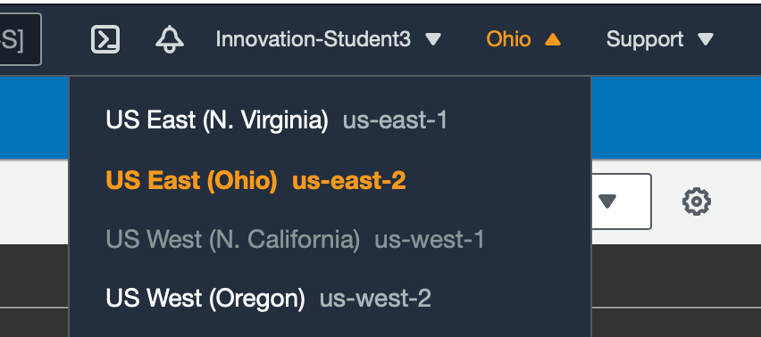

# lab setup

## Lab Setup
In this lab you will log into the AWS Console and start a CloudShell session. We will be using this for all future labs. 

### Log into the AWS Cloud Console
To log into the console go to [https://console.aws.amazon.com/](https://console.aws.amazon.com/) in a browser. Once you have logged in, on the top right side, select the `US-East-2` region. 



### Start the CloudShell 
After selecting the `US-East-2` region, use the search bar at the top of the page to search for `CloudShell`. Click on the result shown in the screenshot.


## Cleanup
Remove any files from previous training sessions.
```bash
rm -rf * && rm -rf $HOME/.local
```

## Update PATH
We need to update the ``$PATH`` variable so our installed binaries override the defaults
Open `$HOME/.bash_profile` in your favorite text editor
```bash
vim $HOME/.bash_profile
```

Replace the PATH line with this: 
```bash
PATH=$HOME/.local/bin:$HOME/bin:$PATH
```

Source the updated file
```bash
source $HOME/.bash_profile
```

## Congratulations
You are now logged into the AWS CloudShell, and ready for future labs. 
