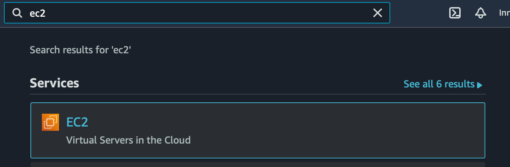
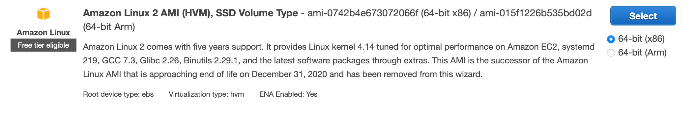

# Terraform Lab 6

## Overview
In this lab you will create some AWS resources using the console, and then import them into Terraform management. 

## Create instances in AWS Console
Create three EC2 instances in the AWS Console. 

1. Using the search bar at the top of the page, search for `ec2`, and click the first result as shown in the screenshot. 


2. In the EC2 dashboard click `instances`, and then `Launch instances`. 
3. In the list, select the top "Amazon Linux" AMI. 


4. Select the `t2.micro` instance type, click `Next: Configure Instance Details`, and set `Number of instances` to 3, leave defaults for all other options. 
5. Click `Next: Add Storage`, and accept defaults 
6. Click `Next:Add Tags` and add Key `role` and Value `terraform`. 
7. Click `Review and Launch`
8. Click `Launch` 

## Create Terraform configuration 
While waiting for the instances to launch create a new working directory and configuration file. 
```sh
mkdir tf-lab4
```
Inside the new directory create a `main.tf` file and add a resource with the following attributes:
- type: `aws_instance`
- name: `tf-example-import`
- ami: AMI from instances created above
- instance_type: The type specified when creating the instance.
- count: `3`
- tags: `Name: TF-example-import`, `role: terraform`

Remember this resource block is for three instances. You will need to add the `count.index` to the `Name` tag. If you get stuck ask the instructor for assistance.

## Import the configuration 
Now that you've created the instances and the Terraform configuration, use the `terraform import` command to import the existing instances. 

If you get stuck check the help page `terraform import --help` or the [terraform documentation](https://www.terraform.io/docs/cli/import/index.html)


