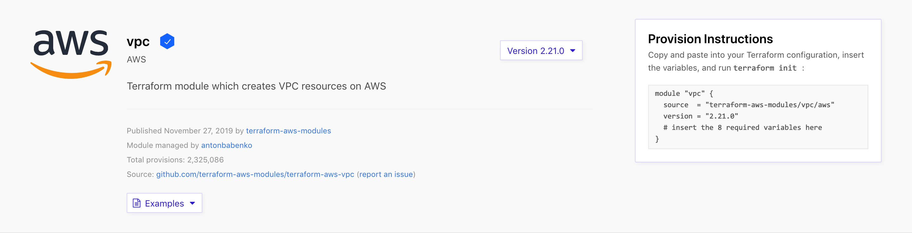

# Terraform Lab 7

## Overview 
In this lab, you will use modules from the Terraform Registry to provision an AWS environment. The concepts you use in this tutorial will apply to any modules from any source.

## The Terraform Registry
Open the [Terraform Registry page for the VPC module](https://registry.terraform.io/modules/terraform-aws-modules/vpc/aws/2.21.0) in your browser.



You will see information about the module, as well as a link to the source repository. On the right side of the page, you will see a dropdown interface to select the module version, as well as instructions to use the module to provision infrastructure.

When calling a module, the `source` argument is required. In this example, Terraform will search for a module in the Terraform registry that matches the given string. You could also use a URL or local file path for the source of your modules.

The other argument shown here is the `version`. For supported sources, the version will let you define which version or versions of the module will be loaded. In this lab, you will specify an exact version number for the modules you use. 

Other arguments to module blocks are treated as input variables to the modules.

## Create Terraform configuration
Now use modules to create an example AWS environment using a Virtual Private Cloud (VPC) and two EC2 instances.

Create working directory
```sh
mkdir tf-lab5
cd $_
```
Clone the GitHub repository.
```sh
git clone https://github.com/jruels/learn-terraform-modules.git
```

Enter the directory.
```sh
cd learn-terraform-modules
```

Check out the `ec2-instances` tag into a local branch.

```sh
git checkout tags/ec2-instances -b ec2-instances
```

Review the `main.tf` and you will see it includes four blocks: 

You will be familiar with the first two blocks, `terraform` and `provider`. We've used them many times in previous labs.

- `module "vpc"` defines a Virtual Private Cloud (VPC), which will provide networking services for the rest of your infrastructure.
- 'module` "ec2_instances"` defines two EC2 instances within your VPC.

## Set values for module input variables
In order to use most modules, you will need to pass input variables to the module configuration. The configuration that calls a module is responsible for setting its input values, which are passed as arguments in the module block. Aside from `source` and `version`, most of the arguments to a module block will set variable values.

On the Terraform registry page for the AWS VPC module, you will see an `Inputs` tab that describes all of the [input variables]()https://registry.terraform.io/modules/terraform-aws-modules/vpc/aws/2.21.0?tab=inputs that module supports.

Some input variables are required, meaning that the module doesn't provide a default value — an explicit value must be provided in order for Terraform to run correctly.

The following variables should look familiar, we set some of these in a previous lab.

Within the `module "vpc"` block, review the input variables you are setting. 
- `name` will be the name of the VPC within AWS
- `cidr` describes the CIDR blocks used within your VPC.
- `azs` are the availability zones that will be used for the VPC's subnets.
- `private_subnets` are subnets within the VPC that will contain resources that do not have a public IP address or route.
- `public_subnets` are subnets that will contain resources with public IP addresses and routes.
- `enable_nat_gateway` if true, the module will provision NAT gateways for your private subnets.
- `tags` specify the tags for each of the resources provisioned by this configuration within AWS.

NOTE: When creating EC2 instances, you need to specify a subnet and security group for them to use. This example will use the ones provided by the VPC module.

## Define root input variables
Using input variables with modules is very similar to how you use variables in any Terraform configuration. A common pattern is to identify which module input variables you might want to change in the future, and create matching variables in your configuration's `variables.tf` file with sensible default values. Those variables can then be passed to the module block as arguments.

Not all module input variables need to be set using variables in your configuration. For instance, you might want this VPC to always have a NAT gateway enabled, because the application you are provisioning requires it. In that case, using a variable to set `enable_nat_gateway` would be counterproductive.

You will need to define these variables in your configuration to use them.

Add the following to `variables.tf`

- variable name: `vpc_name`
- description: `Name of VPC`
- type: `string`
- default: `example-vpc`

- variable name: `vpc_cidr`
- description: `CIDR block for VPC`
- type: `string`
- default: `10.0.0.0/16`

- variable name: `vpc_azs`
- description: `Availability zones for VPC`
- type: `list(string)`
- default: `["us-west-2a", "us-west-2b", "us-west-2c"]`

- variable name: `vpc_private_subnets`
- description: `Private subnets for VPC`
- type: `list(string)`
- default: `["10.0.1.0/24", "10.0.2.0/24"]`

- variable name: `vpc_public_subnets`
- description: `Public subnets for VPC`
- type: `list(string)`
- default: `["10.0.101.0/24", "10.0.102.0/24"]`

- variable name: `vpc_enable_nat_gateway`
- description: `Enable NAT gateway for VPC`
- type: `bool`
- default: `true`

- variable name: `vpc_tags`
- description: `Tags to apply to VPC resources`
- type: `map(string)`
- default: `{
    Terraform   = "true"
    Environment = "dev"
  }`

## Define root output values
Modules also have output values, which are defined within the module with the `output` keyword. You can access them by referring to `module.<MODULE NAME>.<OUTPUT NAME>`. 

Module outputs are usually either passed to other parts of your configuration, or defined as outputs in your root module.

Create the following in `outputs.tf`
```hcl
# Output variable definitions

output "vpc_public_subnets" {
  description = "IDs of the VPC's public subnets"
  value       = module.vpc.public_subnets
}

output "ec2_instance_public_ips" {
  description = "Public IP addresses of EC2 instances"
  value       = module.ec2_instances.public_ip
}
```

The value of the `vpc_public_subnets` will come from the `public_subnets` output from the module named `vpc`, and `ec2_instance_public_ips` is defined as `module.ec2_instances.public_ip`.

## Provision infrastructure 
Initialize the Terraform configuration to download the provider and modules. 

Now run `terraform apply` to create the VPC and instances.

You will notice that many more resources than just the VPC and EC2 instances will be created. The modules we used define what those resources are.

You should now see the instance IP address and vpc public subnets are output to the terminal.

## Understand how modules work
When using a new module for the first time, you must run either `terraform init` or `terraform get` to install the module. When either of these commands are run, Terraform will install any new modules in the `.terraform/modules` directory within your configuration's working directory. For local modules, Terraform will create a symlink to the module's directory. Because of this, any changes to local modules will be effective immediately, without having to re-run `terraform get`.

## Cleanup

Run `terraform destroy` to remove resources.


